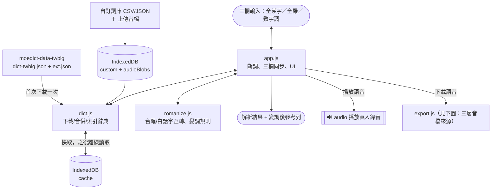
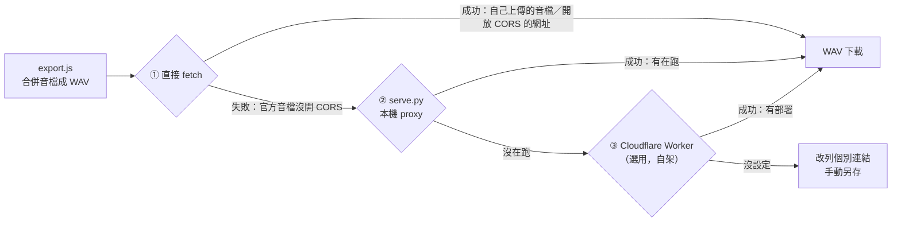

# 台語文字轉語音

單一網頁工具：全漢字／全羅（教育部台羅或白話字 POJ）／羅馬字加音調數字，三種台語書寫方式互相同步，並可播放教育部《臺灣台語常用詞辭典》的真人錄音。

## 使用方式

直接用瀏覽器（建議 Chrome／Edge）開啟 [index.html](index.html) 即可，不需安裝、不需編譯。

- 第一次使用會下載官方辭典資料（兩個檔案共約 10.5MB），下載一次後會快取在瀏覽器（IndexedDB），之後可離線做羅馬字／漢字互轉。
- 若瀏覽器對 `file://` 直接開檔有較嚴格的限制（例如 fetch／IndexedDB 行為異常），可改用本機靜態伺服器開啟，例如：
  ```
  python -m http.server 8000
  ```
  再開 `http://localhost:8000/index.html`。
- 想讓「下載語音」連官方辭典音檔也能合併成一個檔案，改用附的 [serve.py](serve.py) 開頁面（一樣需要 Python）：
  ```
  python serve.py 8791
  ```
  再開 `http://localhost:8791/index.html`。細節見下方「下載語音（WAV）」。

## 部署到 GitHub Pages

這個專案本來就是純靜態檔案，適合直接放 GitHub Pages：

1. 這個資料夾 push 到一個 GitHub repo。
2. repo 設定 → Pages → Source 選「Deploy from a branch」→ 選 `main` 分支、`/ (root)` 資料夾 → Save。
3. 幾分鐘後就能用 `https://<帳號>.github.io/<repo 名稱>/` 開啟。

**注意**：GitHub Pages 是純靜態託管，不能跑 `serve.py`（那支腳本需要真的執行 Python）。所以透過 GitHub Pages 開啟時，「下載語音」遇到官方辭典音檔預設會維持「列出個別連結手動另存」的行為；想讓 Pages 上的版本也能一鍵合併下載，部署下面的 [cloudflare-worker.js](cloudflare-worker.js)（選用，免費）即可。其餘功能（三向同步、播放、自訂詞庫、自訂音檔、點擊修正）在 GitHub Pages 上完全不受影響。

## 讓「下載語音」在 GitHub Pages 上也能合併官方音檔（選用）

`serve.py` 只能在你自己電腦上跑；如果想讓掛在網路上的 Pages 版本也能一鍵合併下載官方辭典音檔，部署一個小小的 Cloudflare Worker 當「一直在線上」版的 proxy，原理跟 `serve.py` 一樣（伺服器對伺服器的請求不受瀏覽器 CORS 限制），只是換成一直開著、你自己控制的雲端帳號，而不是要你自己的電腦開著：

1. 登入 [dash.cloudflare.com](https://dash.cloudflare.com)（沒有帳號免費註冊一個）
2. Workers & Pages → Create → Create Worker，取個名字（例如 `taigi-tts-proxy`），Deploy
3. 進去這個 Worker → Edit code，把 [cloudflare-worker.js](cloudflare-worker.js) 的內容整個貼進去覆蓋預設範例，按 Deploy
4. 會拿到一個網址，像 `https://taigi-tts-proxy.<你的帳號>.workers.dev`；把它填進 [export.js](export.js) 最上面的 `EXTERNAL_PROXY_BASE` 常數，重新 push 到 GitHub 即可生效

這一層只轉發固定格式的萌典音檔編號（不是任意網址的開放轉發站），音檔只會經過你自己控制的兩個地方（你的電腦／你的 Cloudflare 帳號），不會經過任何你不認識的第三方服務。不想用的話，把 `EXTERNAL_PROXY_BASE` 留空字串即可，行為就回到只有 `serve.py` 或個別連結那兩層。

## 功能

- **三種格式互相同步**：編輯全漢字、全羅（可切換教育部台羅／白話字 POJ）、羅馬字加音調數字，任一欄位都會即時反推另外兩欄。沒有固定以哪個欄位為準——頁面上會顯示「目前以哪個欄位為準」，想以羅馬字為主，直接編輯全羅或數字調欄位即可。
- **點擊修正讀音／補音檔**：解析結果列的每個詞都能點擊，打開修改面板。有多個讀音（破音字）的會列成按鈕可直接選；也可以直接輸入正確羅馬字，或上傳這個詞自己的音檔。存檔後疊加進「自訂詞庫」，之後都會用修正過的版本，語音也一併更新。沒有上傳音檔時會自動嘗試合成一個（借用變調後同音字的官方錄音組合，跟「下載語音」同一套機制），真的找不到才維持沒有音檔。
- **辭典沒收錄會警示**：查不到的漢字，或羅馬字沒對應到任何漢字，會在解析結果列標示 ⚠，點擊一樣能直接補上讀音／漢字／音檔。
- **變調後（連讀參考）**：解析結果下方多一列「變調後」，套用台語標準連讀變調規則（規則來源見下方「資料來源」），把本調換算成連續講話時的實際調值——用數字調顯示（不是變音標），方便跟上面「羅馬字加音調數字」欄位逐字對照；純參考顯示，不會回寫到其他欄位。查無讀音、只顯示〔數字調〕占位的詞一樣能套用，因為變調只需要本調數字，不需要真的查到字。另外支援輕聲（羅馬字裡的「--」，例如官方辭典本身就有的「一來」`it--lâi`，前一字因此維持本調，且「--」會原樣保留在全羅／數字調欄位，不會被吃成普通的「-」）與三疊字變調（如「紅紅紅」，最後一字本調、中間字一般變調、第一字本調 1／5／7／8 時變成中升調）。分組簡化為「遇標點就斷開」。
- **沒有音檔時借用變調後同音字的錄音**：有些詞辭典沒錄音（教育部只錄「單字能成詞」的讀音）或查無此字。這時系統會用該詞「變調後」算出的讀音反查辭典：先試整個詞一起查（最準），查不到的話（多音節複合詞常見）再逐音節分開查、各自借用同音字錄音接起來播（要每個音節都借得到才用）。找到的話借用該字（或每個音節各自的字）的錄音播放（畫面上淺藍底線＋`~`標示，可看借用自哪個字）。規則是詞本身有音檔就優先用自己的（主），沒有才用變調後借來的（副）。
- **播放語音**：依詞序接續播放教育部辭典的真人錄音（非語音合成）；會先預先載入下一個字的音檔，並依標點給不同停頓長度（詞間幾乎不停、逗號稍停、句號停更久），減少逐字唱名感。大部分詞播放的仍是各自的本調錄音（沒有連讀變調），只有原本查無音檔、剛好被「借用變調後同音字錄音」機制救回來的詞才會是變調後的音——整體聽起來還是不會等同一句由人自然講出的流暢口語，這是音檔來源（單字本調真人錄音為主）的性質限制。
- **語速調整**：播放時可選 0.5×～4× 播放速度。
- **下載語音（WAV）**：把目前這句的音檔合併成一個 WAV 檔下載。教育部辭典音檔伺服器未開放跨網域讀取（非本工具的限制，瀏覽器安全機制強制靜音），單純雙擊 `index.html` 或用 `python -m http.server` 開啟時，遇到官方音檔會改列出個別連結供手動另存；改用 `python serve.py` 開啟，或部署 [cloudflare-worker.js](cloudflare-worker.js)（本機／雲端各自獨立，可以只用一個、也可以兩個都設定，程式會依序自動嘗試），就能連官方音檔一起合併下載，不經過任何第三方服務。使用者自己上傳的音檔則不受此限制，一律能合併。
- **自訂詞庫**：匯入 CSV 或 JSON 補充辭典沒有的詞（人名、地名、方言用字…），疊加在官方資料之上、可覆蓋預設讀音，原本官方讀音仍可點擊切換查看。格式與範例見 [custom-dictionary-example.csv](custom-dictionary-example.csv)／[custom-dictionary-example.json](custom-dictionary-example.json)，頁面下方 footer 也有說明。自己用 Excel 編輯 CSV 時記得存成「CSV UTF-8」，不要存一般「CSV」，不然用 Excel 直接雙擊開啟時中文會變亂碼（本工具匯入不受影響）。「查看自訂詞庫」可以展開列表看目前存的內容（含試聽音檔）並單獨刪除某一筆；「匯出自訂詞庫（含音檔，JSON）」會把本機上傳的音檔內嵌進同一個檔案，匯出後直接用「匯入自訂詞庫」讀回來就會連音檔一起還原，適合備份或搬到別台裝置繼續用。
- **自訂音檔**：自訂詞庫的「音檔」欄位可以只填檔名，再用「上傳自訂音檔」選取本機錄音檔案，不需要架網站。音檔存在瀏覽器本機（IndexedDB），不會外傳。
- **明亮／深色模式**：預設跟隨系統，右上角按鈕可手動切換並記住選擇。
- **手機模式**：窄螢幕會自動改成單欄、可點擊區域加大的版面。
- **使用說明**：右上角「❓ 說明」可展開／收合頁內完整說明與修改日誌，不用另外開 README。

## 檔案結構

| 檔案 | 用途 |
|---|---|
| `index.html` | 頁面結構 |
| `style.css` | 樣式（含明亮／深色主題、手機響應式） |
| `romanize.js` | 教育部台羅／白話字互轉、變音標⇄數字調互轉的純邏輯（無外部依賴） |
| `dict.js` | 官方辭典下載＋索引＋IndexedDB 快取；自訂詞庫與自訂音檔的匯入／查詢 |
| `export.js` | 把播放序列合併匯出成 WAV |
| `app.js` | 斷詞、畫面同步、播放、UI 事件綁定 |
| `custom-dictionary-example.csv` / `.json` | 自訂詞庫格式範例 |
| `serve.py` | 選用：本機靜態伺服器＋音檔 proxy，讓「下載語音」也能合併官方辭典音檔 |
| `cloudflare-worker.js` | 選用：部署到自己 Cloudflare 帳號的雲端版音檔 proxy，效果跟 `serve.py` 一樣但不用開著電腦 |

沒有建置流程、沒有外部 CDN 依賴，四支 `.js` 用一般 `<script>` 依序載入（`romanize.js` → `dict.js` → `export.js` → `app.js`）。

## 架構圖

以下用 GitHub 原生支援的 Mermaid 語法畫（線上開 README 時會自動變成互動式的圖）；同樣的圖也存成 SVG 檔案在 [docs/](docs) 資料夾，不需要連網、也不需要 Markdown 工具支援 Mermaid，直接用瀏覽器或任何看圖軟體開啟 SVG 檔就能看：[docs/architecture-overview.svg](docs/architecture-overview.svg)、[docs/architecture-download.svg](docs/architecture-download.svg)。改動下面的 Mermaid 原始碼後，記得也重新產生這兩個 SVG（`npx @mermaid-js/mermaid-cli -i <檔名>.mmd -o docs/<檔名>.svg -b white`），不然兩邊會不同步。

**整體資料流：**



**「下載語音」的三層音檔來源**（一般播放不受這三層影響，一律直接用 `<audio>` 播放）：



## 資料來源

- **辭典原始資料**：教育部《臺灣台語常用詞辭典》(sutian.moe.edu.tw)。
- **整理成 JSON 的版本**：[g0v/moedict-data-twblg](https://github.com/g0v/moedict-data-twblg)（萌典社群專案），格式轉換與整理部分以 CC0 釋出。本工具實際下載、合併的兩個檔案：
  - 主檔案（常用詞，約 14,500 筆）：[dict-twblg.json](https://github.com/g0v/moedict-data-twblg/blob/master/dict-twblg.json)
  - 附加檔案（補充詞，約 6,800 筆）：[dict-twblg-ext.json](https://github.com/g0v/moedict-data-twblg/blob/master/dict-twblg-ext.json)

  兩份合併去重後目前約 20,600 個詞條，載入時由 `dict.js` 的 `fetchRaw()` 依序下載這兩個檔案並合併建索引，細節與快取版本號（cache-busting）邏輯見該檔案的註解。
- **語音**：上述兩個 JSON 檔案裡各詞條附的真人錄音，實際音檔檔案託管在 `r2-assets.moedict.tw`（萌典專案自己的音檔伺服器），並非語音合成。
- **連讀變調規則**：`romanize.js` 的 `sandhiTone()` 規則表，參考使用者提供的「Taiwanese Lô-má-jī Tone Sandhi Tool」（Tō͘ Sìn-liông 製作）整理的標準變調循環與入聲變調規則。

## 資料存放與備份

辭典快取、自訂詞庫、自訂音檔全部存在瀏覽器本機的 IndexedDB（`taigi-tts-dict` 這個資料庫），不會上傳到任何伺服器。只要是同一台電腦、同一個瀏覽器、不是無痕視窗，資料會自動留著，重開頁面、重開瀏覽器都還在，**不需要每次手動匯出**。

需要匯出（「查看自訂詞庫」列表裡的「匯出自訂詞庫（含音檔，JSON）」）的情況：

- 想要備份，怕清瀏覽器資料、重灌電腦、瀏覽器更新出包等意外把 IndexedDB 洗掉
- 想換一台電腦或換瀏覽器繼續用同一份自訂詞庫
- 用無痕視窗（分頁關掉後 IndexedDB 就會被清掉，這種情況一定要匯出才留得住）
- 想把自訂詞庫分享給別人

匯出出來就是一個一般的 JSON 檔案，存在你自己的下載資料夾，等同一份直接放在本機硬碟上的備份，可以自己搬到任何地方保存；之後要復原，直接用「匯入自訂詞庫」讀回來即可（讀音跟內嵌的音檔會一起還原）。

## 已知限制

- 辭典收錄約 20,600 個詞（常用詞＋補充詞兩個檔案合併），罕用字詞、專有名詞仍可能查不到（可用自訂詞庫補充）。
- 多音字（破音字）預設取辭典裡第一筆讀音，可點擊切換。
- 官方辭典音檔伺服器沒有開放 CORS；單純開檔或用 `http.server` 時「下載語音」只能合併自訂音檔，官方音檔只能個別開新分頁另存——改用 `serve.py`（本機）或部署 `cloudflare-worker.js`（雲端，GitHub Pages 上也能用）可以解除這個限制。
- 台羅／白話字自動轉換是規則式的（聲母、韻母、鼻化、調號標記規則），涵蓋常見組合；極罕見的韻母組合可能標錯調號位置。
- 漢字斷詞是辭典比對式的「由長到短」貪婪演算法，非統計式斷詞，複合詞若不在辭典中會退回逐字比對。
- 播放的是各自獨立錄製的單字音檔依序接續，沒有連續語流的連讀變調，聽感上不會等同一句流暢口語。多數詞播放的是自己的本調錄音；「借用變調後同音字錄音」機制只在該詞本身查無音檔時才生效，而且借來的仍是別的字固定的本調錄音（沒有即時變調合成這種東西），只是那個字剛好本調就唸這個音而已。
- 「借用變調後同音字的錄音」找到的是「聲音剛好一樣」的字，不保證語感自然（極端情況下可能借到罕用字、生僻字的錄音）；找不到剛好對得上的字時，該詞就仍然沒有音檔可播放。
- 變調分組是「遇主要標點就斷開」的簡化版，複雜句子（例如巢狀輕聲、超過三個字的疊字）的實際語感可能跟這個參考列有落差。

## 修改日誌

- **v1.15.0 — 2026-09-12**
  - 修正白話字（POJ）「羅馬字加音調數字」欄位混入 `o͘`（U+0358 combining dot above right）／`ⁿ`（U+207F superscript n）這兩個特殊 unicode 符號的問題：`romanize.js` 把 `skeletonToPoj()` 拆成 `skeletonToPojLetters()`（純 ASCII 的聲母／韻母替換：chh/ch/oa/oe/eng/ek，oo/nn 保持原樣）跟原本的 `skeletonToPoj()`（在 letters 之上再套 o͘／ⁿ），`toPojNumeric()` 改用前者
  - 原因：`o͘` 用的組合字元很多字型沒有對應字形，畫面上那個點常常直接看不見，「看護」khan-hō͘ 轉出來的數字調看起來會像少一個 o 的 `khan1-ho7`（骨架其實沒錯，只是那個點沒被畫出來）；`ⁿ` 顯示雖然正常，但作為非 ASCII 字元，拿去做音檔檔名比對或貼到其他工具比對時常常對不起來——這是使用者實測回報的兩個症狀
  - 白話字變音標欄位（顯示 `hō͘`／`piⁿ` 這種正字法）維持原樣不受影響，因為那裡本來就需要真正的白話字符號；只有數字調欄位改成一律純 ASCII 的 `oo`／`nn`（例如 `khan1-hoo7`、`pinn1`）
- **v1.14.1 — 2026-09-12**
  - 修正自動合成音檔常常失敗的問題：`app.js` 新增 `findAudioCandidates()`（回傳「所有」同音候選，不只第一個）與 `findWorkingAudioUrl()`（依序實際試抓每個候選的位元組，抓不到就換下一個），`autoSynthesizeAudio()` 改用這兩個函式，不再是找到第一個「有音檔 id」的候選就直接用——教育部辭典資料裡不少字雖然列了音檔編號，實際上並沒有真的錄過單字音（「單字不成詞者不單獨錄音」，見「資料來源」），之前遇到這種情況會直接判定整個詞合成失敗
  - `export.js` 額外匯出 `fetchAudioBytes`，供上述候選試抓使用
  - 語速選項加到 6×（原本最高 4×）
  - 修正語速選單其實一直沒有真的生效的 bug：`app.js` 的 `makeAudio()` 原本在呼叫 `audio.load()` 之前就設定 `playbackRate`，但瀏覽器的 `load()` 會把 `playbackRate` 重設回 1，等於白設，所有播放不論選哪個語速實際上都是 1×。改成 `load()` 之後才設定 `playbackRate`（實測用 Playwright 直接攔截 `HTMLMediaElement.prototype.play` 確認過，`load()` 前設定會被重設、`load()` 後設定會在整個載入過程中保留）
- **v1.13.0 — 2026-09-12**
  - 補上讀音時若沒有上傳音檔，`app.js` 新增 `autoSynthesizeAudio()`：用跟「下載語音」相同的 `AudioExport.combineToWav` 機制，借用這個詞（word-internal 變調後）同音字的官方錄音組合成一個 WAV，自動存進自訂音檔（`Dict.importAudioFiles`）當作這筆自訂詞的音檔。找不到可借用的錄音、或目前環境讀不到官方音檔位元組（沒有 serve.py／Cloudflare Worker）時，維持原本「留空、之後可自行上傳」的行為，不擋住存檔
  - `dict.js` 新增 `findCustomAudio(hanzi, trs)`：重新編輯一個已經有音檔（自己上傳或自動合成皆可）的詞、這次沒有重新選檔案時，會先查出原本的音檔沿用，不會被清空或被新的自動合成結果覆蓋（檔案選取欄位每次打開編輯面板都是空的，「這次沒選檔案」不代表「本來就沒有音檔」）
  - 修正 `Dict.addCustomEntry`：點擊同一個詞重新補上讀音／音檔時，原本會多存一筆重複資料（舊的沒音檔那筆留著不會被清掉）。現在存檔時若「同一個漢字＋同一個實際讀音」（用 `wordKeyOf` 比對骨架＋調號，不看表面拼法）已存在，直接取代那一筆；真正不同讀音（破音字）才新增成獨立一筆，多讀音切換功能不受影響
- **v1.12.0 — 2026-09-12**
  - 新增「查看自訂詞庫」：「匯入自訂詞庫」旁邊多一個按鈕，展開列表看目前存的每一筆（漢字／讀音／音檔，可直接試聽），每一筆能單獨刪除（`dict.js` 新增 `getCustomEntries` / `removeCustomEntry`）
  - 新增「匯出自訂詞庫（含音檔，JSON）」：把本機上傳的音檔內嵌成 `data:` URL 一起存進同一個 JSON 檔（`dict.js` 新增 `exportCustomWithAudio`），匯出的檔案可以直接用既有的「匯入自訂詞庫」讀回來，讀音跟音檔一起還原，不用另外管理音檔案，方便備份或搬到別台裝置繼續累積用
- **v1.11.1 — 2026-09-12**
  - 修正「補上讀音」編輯面板在頁面一載入就整個顯示出來的 CSS 錯誤：`.token-editor` 自己設了 `display: flex`，蓋掉瀏覽器內建的 `[hidden]` 隱藏效果；改成全站統一用 `[hidden] { display: none !important; }`（`style.css`）保證任何元素設了 `hidden` 屬性都真的會被藏起來，不會被其他 class 的 `display` 規則蓋掉
  - 確認並記錄：點詞條補上讀音時，「正確讀音」跟「上傳這個詞的音檔」本來就是同一個「儲存」按鈕一起存進自訂詞庫（`app.js` 的 `tokenEditorSave` 點擊處理已經是 `importAudioFiles` + `addCustomEntry` 一起做），不需要額外新增功能
- **v1.11.0 — 2026-09-12**
  - 修正變調範圍的判斷單位：原本整個標點分隔的子句一起判斷（只有子句最後一音節維持本調），現在改成以「詞」為單位——每個辭典詞、或用 `-` 接起來的羅馬字組，只有該詞自己的尾字維持本調，不受後面接了什麼字影響（`app.js` 的 `computeSandhiSyllables`，`isGroupFinal` 改成逐詞判斷的 `wordFinal`）
  - 這個修正也連帶讓由多個「各自查得到的一字詞」組成的句子（例如「我食飯」）維持全部本調不變調——套用參考變調工具明訂的「一字組不變調」規則後的正確結果，跟舊版「整句一起判斷」的行為不同，屬預期變更
- **v1.10.0 — 2026-09-12**
  - 「變調後」列補上輕聲（`romanize.js` 的 `parseWord()` 現在會分辨「--」跟一般「-」，前一字因此維持本調不變調）與三疊字變調（`sandhiTripleFirst()`）兩條規則
  - 修正一個連帶發現的舊 bug：`app.js` 的 `segmentRomanization` 原本自己手動切割音節再逐個丟給 `Romanize.parse()`，沒有走 `parseWord()`，導致使用者在羅馬字欄位直接打「--」永遠不會被辨識成輕聲（只有透過辭典查到的詞才會生效）；改成呼叫 `parseWord()` 後兩邊行為一致
  - 附帶效果：官方辭典裡本來就用「--」標記輕聲的詞條（例如「一來」`it--lâi`，全辭典共 198 筆），全羅／數字調欄位現在會正確保留這個標記，不會再被吃成普通的「-」
- **v1.9.3 — 2026-09-12**
  - 修正：播放語音時按「停止」，如果剛好打斷正在播放的音檔（不是打斷詞與詞之間的停頓），播放鍵和停止鍵會永遠恢復不了、整個播放功能卡死。原因是 `audio.pause()` 不會觸發 `ended`／`error` 事件，而播放邏輯只在等這兩個事件，導致整個 `await` 永遠不會繼續往下走。修法是多監聽 `pause` 事件。
- **v1.9.2 — 2026-09-12**
  - 架構圖新增離線可看的 SVG 檔案（`docs/architecture-overview.svg`、`docs/architecture-download.svg`），不用連網、不用 Markdown 工具支援 Mermaid 也能開
- **v1.9.1 — 2026-09-12**
  - 頁面上方的「最後更新」加上時分，不只日期
  - 新增下方「架構圖」章節
- **v1.9.0 — 2026-09-12**
  - 「變調後」列改用數字調顯示（不用變音標），方便跟「羅馬字加音調數字」欄位逐字對照
  - 借用同音字錄音的機制擴充：整個詞一起查找不到時（多音節複合詞常見），改成逐音節分開查、各自借用同音字錄音接起來播放（要每個音節都借得到才用）；播放序列與下載合併都同步支援一個詞對應多段音檔
- **v1.8.1 — 2026-09-12**
  - 修正：貼上的文章裡，字詞後面緊貼標點（沒有空白，例如 `chok-iong.`、`kò-chō,`）時，整個詞會解析失敗、原封不動顯示，不會轉換成漢字／另一種羅馬字——`segmentRomanization` 現在會先把頭尾黏著的標點拆成獨立文字，再解析詞本體
- **v1.8.0 — 2026-09-12**
  - 沒有音檔的詞，改用「變調後」算出的讀音反查辭典，找到剛好同音的字就借用它的錄音播放（主：詞本身音檔優先；副：借用變調後同音字音檔）；畫面上以淺藍底線＋`~`標示借用的詞
- **v1.7.0 — 2026-09-12**
  - 解析結果下方新增「變調後」參考列（`romanize.js` 的 `sandhiTone()`），套用標準連讀變調規則；查無讀音、只有〔數字調〕占位的詞也能參與計算
- **v1.6.1 — 2026-09-12**
  - 語速選項加到 4×（原本最高 2×）
- **v1.6.0 — 2026-09-11**
  - 併入 [dict-twblg-ext.json](https://github.com/g0v/moedict-data-twblg/blob/master/dict-twblg-ext.json)（萌典補充詞資料，約 6,800 筆，同樣有真人錄音），跟原本的常用詞檔案合併，辭典收錄從約 14,500 詞增加到約 20,600 詞；辭典快取版本 bump（`dict-twblg-v2`），舊使用者會自動重新下載一次合併後的版本
- **v1.5.1 — 2026-09-11**
  - 修正 `custom-dictionary-example.csv` 用 Excel 雙擊開啟會變亂碼的問題（原本缺 UTF-8 BOM，Excel 沒有 BOM 時會用系統預設編碼猜測，中文因此變亂碼；VS Code 等其他編輯器本來就沒有這個問題）；CSV 匯入邏輯也加了防禦性的 BOM 去除
  - 自訂詞庫說明加上「用 Excel 編輯要存成 CSV UTF-8」的提醒
- **v1.5.0 — 2026-09-11**
  - 新增 `cloudflare-worker.js`（選用）：部署到自己的 Cloudflare 帳號，讓 GitHub Pages 上的版本也能一鍵合併下載官方辭典音檔，不需要本機開著 `serve.py`；`export.js` 依序嘗試直接讀取／本機 `serve.py`／這個雲端 proxy，兩種都設定也可以並存
- **v1.4.0 — 2026-09-11**
  - 修正：切換全羅書寫系統（教育部台羅／白話字）時，「羅馬字加音調數字」欄位沒有跟著變成對應寫法的問題——現在兩欄會一起切換
  - 頁面上方加上版本號與最後更新日期
- **v1.3.0 — 2026-09-11**
  - 加入 GitHub Pages 部署設定（`.nojekyll`、`.gitignore`）與說明
- **v1.2.0 — 2026-09-11**
  - 新增 `serve.py`（選用）：本機小 proxy，讓「下載語音」也能合併官方辭典音檔（原本因對方伺服器 CORS 限制只能列個別連結），不經任何第三方伺服器
- **v1.1.0 — 2026-09-11**
  - 新增點擊詞條即可修正讀音／補音檔（含辭典未收錄的 ⚠ 警示與補登，存進自訂詞庫）
  - 新增頁面上「目前以哪個欄位為準」的同步方向指示
  - 明亮／深色模式手動切換（記住選擇）
  - 語速調整（0.5×～2×）
  - 手機響應式版面
  - 播放節奏優化：依標點停頓（逗號／句號長短不同）＋音檔預先載入，減少卡頓與逐字唱名感
  - 新增頁內「❓ 說明」面板（含本修改日誌）
- **v1.0.0 — 2026-09-10**
  - 初版：全漢字／全羅（教育部台羅／白話字 POJ）／羅馬字加音調數字三向同步
  - 播放教育部辭典真人錄音、多音字循環切換
  - 自訂詞庫匯入（CSV／JSON）
  - 自訂音檔上傳（本機檔名配對，存 IndexedDB）
  - 下載語音（WAV）；官方辭典音檔因對方伺服器 CORS 限制無法合併，改列個別連結供手動另存
